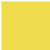

<!-- <link rel="stylesheet" href="devicon.min.css"> -->

    <h1 style="border: 0; margin-top: 0; margin-bottom: 5px;">Jake Stanier</h1>
    <h2 style="border: 0; margin-top: 0; margin-bottom: 5px;">Junior Software Devloper</h2>
    

    
    
    <!--  -->
    

<h3>About Me</h3>

Hi There 👋 I'm Jake. A Junior Software Developer with a passion for solving real world problems with technology! I enjoy the challenge of continuous learning and I am currently seeking my first role in the industry.

<h3>Personal Projects 🤖</h3>
<ul style="margin-bottom: 15px">
    <li>
        <a target="_blank" href="https://the-run-club.netlify.app/">The Run Club</a>
The Run Club is the latest iteration of 'StravaJS'. Implementing Strava's <a target="_blank" href="https://developers.strava.com/docs/authentication/">OAuth technology</a>, the app allows users to authenticate via Strava for faster, seamless data visualisation. Submitting the app to Strava themselves allowed me to obtain increased capacity for up to 1000 users.

    </li>
    <li>
        <a target="_blank" href="https://stravajs.netlify.app/">StravaJS</a>
Strava JS ustilises the <a target="_blank" href="https://developers.strava.com/docs/reference/">Strava API</a> to collect and display run data in an easily digestible format. It was developed to help keep track of a group of friends 10k per week challenge.

    </li>
    <li>
        <a target="_blank" href="https://github.com/jake-stan92/timezone">TimeZone</a>
Timezone was built to help a relative manage their global client meetings. Built in Python, Timezone calculates different times in selected timezones relative to a given or current time.

    </li>
</ul>

<h3>Lets Collab! 🙌</h3>

I am always looking to sharpen my skills and learn new ones. If you have a project you want to work on together or have a far out idea, let me know and we can get the ball rolling! 😀

<h3>My (current) TechStack:</h3>

    
    
    
    
    
    
    
    

<!--
**jake-stan92/jake-stan92** is a ✨ _special_ ✨ repository because its `README.md` (this file) appears on your GitHub profile.

Here are some ideas to get you started:

- 🔭 I’m currently working on ...
- 🌱 I’m currently learning ...
- 👯 I’m looking to collaborate on ...
- 🤔 I’m looking for help with ...
- 💬 Ask me about ...
- 📫 How to reach me: ...
- 😄 Pronouns: ...
- ⚡ Fun fact: ...
-->
